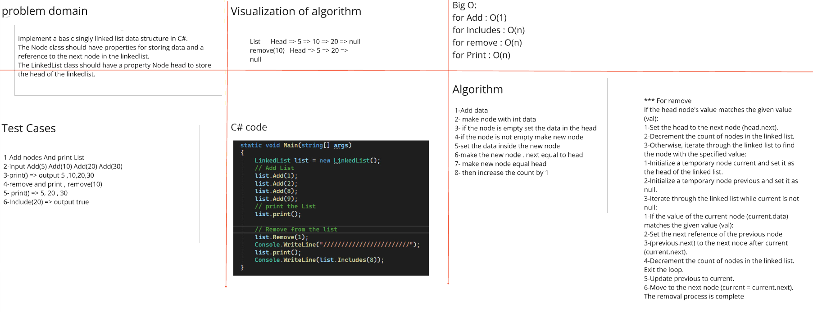

#Problem Domain
Implement a basic singly linked list data structure in C#.

The Node class should have properties for storing data and a reference to the next node in the linkedlist.

The LinkedList class should have a property Node head to store the head of the linkedlist.

The LinkedList class should support methods to:

1. Includes(int data): Check if the linked List contains a node with the specified value.
2. Remove(int data): Remove the first node with the specified data from the linkedlist.
3. PrintList(): Print the contents of the list in order.

##Whiteboard Images

### Challenge Linked List Implementation

### Challenge Linked List Remove Duplicates
[Remove Duplicates](./LinkedList/LinkedList/Remove_Duplicat/README.md)

